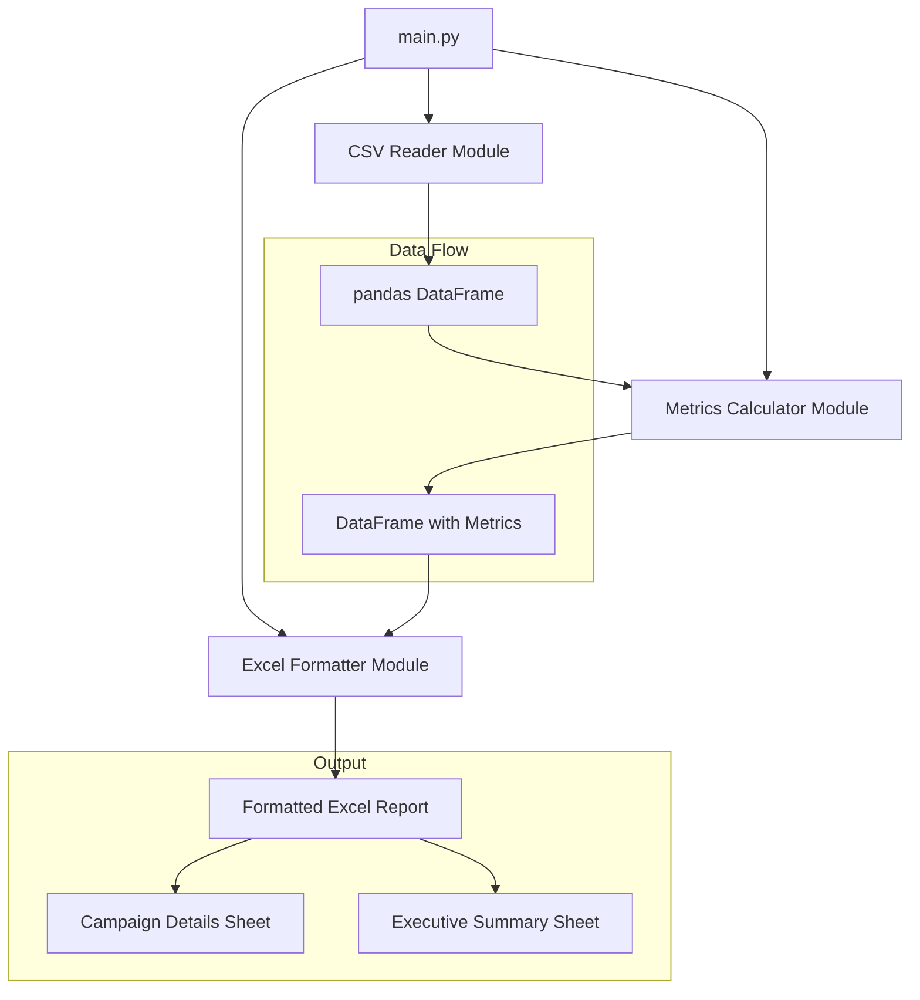

# Design Document

## Overview

**Repository**: https://github.com/Herman940306/AdMetric-Pro.git

AdMetric Pro is a modular Python automation utility that transforms Meta Ads CSV exports into professionally formatted Excel reports. The system follows a clean separation of concerns with distinct modules for data ingestion, metric calculation, and Excel formatting/styling.

The architecture prioritizes:
- **Reliability**: Comprehensive error handling with professional logging
- **Maintainability**: Modular design allowing independent testing and updates
- **Client-Readiness**: Professional formatting with Executive Summary dashboard

## Architecture



### Module Structure

```
admetric-pro/
├── src/
│   ├── __init__.py
│   ├── main.py              # Entry point with CLI interface
│   ├── csv_reader.py        # CSV ingestion and column mapping
│   ├── metrics.py           # CTR/CPC calculations
│   └── excel_formatter.py   # Excel styling and output
├── tests/
│   ├── __init__.py
│   ├── test_csv_reader.py
│   ├── test_metrics.py
│   └── test_excel_formatter.py
├── mock_data/
│   └── sample_meta_ads.csv
├── output/                  # Generated reports (gitignored)
├── requirements.txt
└── README.md
```

## Components and Interfaces

### 1. CSV Reader Module (`csv_reader.py`)

**Purpose**: Handle CSV file ingestion, validation, and column mapping.

```python
def read_meta_csv(file_path: str) -> pd.DataFrame:
    """
    Read and validate a Meta Ads CSV file.
    
    Args:
        file_path: Path to the Meta Ads CSV file.
        
    Returns:
        DataFrame with mapped columns: Campaign Name, Amount Spent (ZAR), 
        Link Clicks, Impressions.
        
    Raises:
        FileNotFoundError: If file does not exist.
        ValueError: If required columns are missing.
    """
```

**Required Column Mapping**:
| CSV Column | Internal Name |
|------------|---------------|
| Campaign Name | campaign_name |
| Amount Spent (ZAR) | amount_spent |
| Link Clicks | link_clicks |
| Impressions | impressions |

### 2. Metrics Calculator Module (`metrics.py`)

**Purpose**: Calculate CTR and CPC with zero-division protection.

```python
def calculate_ctr(clicks: int, impressions: int) -> float:
    """
    Calculate Click-Through Rate.
    
    Args:
        clicks: Number of link clicks.
        impressions: Number of impressions.
        
    Returns:
        CTR as percentage (0.0 if impressions is zero).
    """

def calculate_cpc(spend: float, clicks: int) -> float:
    """
    Calculate Cost Per Click.
    
    Args:
        spend: Amount spent in ZAR.
        clicks: Number of link clicks.
        
    Returns:
        CPC in ZAR (0.0 if clicks is zero).
    """

def add_metrics_to_dataframe(df: pd.DataFrame) -> pd.DataFrame:
    """
    Add CTR and CPC columns to campaign DataFrame.
    
    Args:
        df: DataFrame with amount_spent, link_clicks, impressions columns.
        
    Returns:
        DataFrame with additional ctr and cpc columns.
    """
```

### 3. Excel Formatter Module (`excel_formatter.py`)

**Purpose**: Generate professionally formatted Excel reports with styling.

```python
def generate_report(df: pd.DataFrame, output_dir: str = "output") -> str:
    """
    Generate formatted Excel report with Campaign Details and Executive Summary.
    
    Args:
        df: DataFrame with campaign data and calculated metrics.
        output_dir: Directory for output file.
        
    Returns:
        Path to generated Excel file.
    """

def apply_header_formatting(worksheet, header_row: int = 1) -> None:
    """Apply bold text and dark blue background to header row."""

def apply_currency_formatting(worksheet, columns: list[str]) -> None:
    """Apply ZAR currency format to specified columns."""

def apply_conditional_formatting(worksheet, cpc_column: str, threshold: float = 20.0) -> None:
    """Apply red highlighting to rows where CPC exceeds threshold."""

def create_executive_summary(workbook, df: pd.DataFrame) -> None:
    """Create Executive Summary worksheet with aggregated metrics."""

def generate_timestamped_filename() -> str:
    """Generate filename in format AdMetric_Pro_Report_YYYY-MM-DD_HHMM.xlsx."""
```

### 4. Main Entry Point (`main.py`)

**Purpose**: CLI interface for running the processor.

```python
def main(input_file: str, output_dir: str = "output") -> None:
    """
    Main entry point for AdMetric Pro.
    
    Args:
        input_file: Path to Meta Ads CSV file.
        output_dir: Directory for output Excel report.
    """
```

## Data Models

### Campaign Data Schema

| Field | Type | Description |
|-------|------|-------------|
| campaign_name | str | Name of the advertising campaign |
| amount_spent | float | Spend in ZAR |
| link_clicks | int | Number of link clicks |
| impressions | int | Number of ad impressions |
| ctr | float | Calculated Click-Through Rate (%) |
| cpc | float | Calculated Cost Per Click (ZAR) |

### Executive Summary Schema

| Metric | Type | Calculation |
|--------|------|-------------|
| Total Spend | float | Sum of amount_spent |
| Total Impressions | int | Sum of impressions |
| Total Clicks | int | Sum of link_clicks |
| Average CPC | float | Total Spend / Total Clicks |
| Overall CTR | float | (Total Clicks / Total Impressions) × 100 |


## Correctness Properties

*A property is a characteristic or behavior that should hold true across all valid executions of a system-essentially, a formal statement about what the system should do. Properties serve as the bridge between human-readable specifications and machine-verifiable correctness guarantees.*

### Property 1: CSV Data Preservation

*For any* valid Meta Ads CSV file containing campaign data, reading the file and extracting columns SHALL produce a DataFrame where each row's values match the original CSV values exactly.

**Validates: Requirements 1.1, 2.1**

### Property 2: CTR Calculation Correctness

*For any* campaign with non-zero impressions, the calculated CTR SHALL equal (link_clicks / impressions) × 100, and for zero impressions, CTR SHALL equal 0.0.

**Validates: Requirements 3.1, 3.3**

### Property 3: CPC Calculation Correctness

*For any* campaign with non-zero link clicks, the calculated CPC SHALL equal (amount_spent / link_clicks), and for zero clicks, CPC SHALL equal 0.0.

**Validates: Requirements 3.2, 3.4**

### Property 4: Header Formatting Consistency

*For any* generated Excel report, all header cells in the first row SHALL have bold font and dark blue background color applied.

**Validates: Requirements 4.1, 4.2**

### Property 5: Currency Formatting Application

*For any* generated Excel report, the Amount Spent and CPC columns SHALL have ZAR currency number format applied to all data cells.

**Validates: Requirements 4.3**

### Property 6: CPC Threshold Highlighting

*For any* campaign row in the generated Excel report, if CPC exceeds R20.00 then the row SHALL have red background highlighting, otherwise the row SHALL have no red highlighting.

**Validates: Requirements 5.1, 5.2**

### Property 7: Excel Data Round-Trip

*For any* processed campaign DataFrame, writing to Excel and reading back SHALL produce equivalent data values for all campaign metrics.

**Validates: Requirements 6.1, 6.2**

### Property 8: Executive Summary Aggregation

*For any* set of campaign data, the Executive Summary SHALL display:
- Total Spend equal to sum of all amount_spent values
- Total Impressions equal to sum of all impressions values
- Total Clicks equal to sum of all link_clicks values
- Average CPC equal to Total Spend / Total Clicks (or 0 if no clicks)
- Overall CTR equal to (Total Clicks / Total Impressions) × 100 (or 0 if no impressions)

**Validates: Requirements 7.2, 7.3, 7.4, 7.5, 7.6**

### Property 9: Timestamped Filename Format

*For any* generated report, the output filename SHALL match the pattern `AdMetric_Pro_Report_YYYY-MM-DD_HHMM.xlsx` where YYYY-MM-DD_HHMM represents the generation timestamp.

**Validates: Requirements 8.1**

## Error Handling

### File Operations

| Error Condition | Handling Strategy |
|-----------------|-------------------|
| File not found | Log error with file path, raise `FileNotFoundError` |
| Invalid CSV format | Log error with details, raise `ValueError` |
| Missing required column | Log error specifying column name, raise `ValueError` |
| Excel write failure | Log error with details, raise `IOError` |

### Calculation Edge Cases

| Condition | Handling |
|-----------|----------|
| Zero impressions | Return CTR = 0.0 |
| Zero clicks | Return CPC = 0.0 |
| Empty DataFrame | Generate report with empty data sheet, summary shows zeros |

### Logging Strategy

All modules use Python's `logging` module with the following levels:
- `INFO`: Successful operations (file loaded, report generated)
- `WARNING`: Non-critical issues (empty data)
- `ERROR`: Operation failures (missing files, invalid data)

```python
import logging

logging.basicConfig(
    level=logging.INFO,
    format='%(asctime)s - %(name)s - %(levelname)s - %(message)s'
)
```

## Testing Strategy

### Property-Based Testing Framework

**Library**: `hypothesis` (Python property-based testing library)

**Configuration**: Each property test runs a minimum of 100 iterations.

### Test Structure

#### Unit Tests (`tests/test_*.py`)

Unit tests verify specific examples and edge cases:

1. **test_csv_reader.py**
   - Test loading valid CSV file
   - Test handling missing file
   - Test handling missing columns
   - Test handling malformed CSV

2. **test_metrics.py**
   - Test CTR calculation with known values
   - Test CPC calculation with known values
   - Test zero-division handling

3. **test_excel_formatter.py**
   - Test header formatting applied
   - Test currency formatting applied
   - Test conditional formatting threshold
   - Test Executive Summary creation
   - Test filename generation format

#### Property-Based Tests (`tests/test_properties.py`)

Property tests verify universal correctness properties:

1. **Property 1**: CSV data preservation
   - Generate random campaign data, write to CSV, read back, verify equality

2. **Property 2**: CTR calculation correctness
   - Generate random clicks/impressions, verify formula

3. **Property 3**: CPC calculation correctness
   - Generate random spend/clicks, verify formula

4. **Property 4**: Header formatting consistency
   - Generate reports, verify all headers formatted

5. **Property 5**: Currency formatting application
   - Generate reports, verify currency columns formatted

6. **Property 6**: CPC threshold highlighting
   - Generate campaigns with various CPC values, verify highlighting rules

7. **Property 7**: Excel data round-trip
   - Generate data, write to Excel, read back, verify equality

8. **Property 8**: Executive Summary aggregation
   - Generate campaign sets, verify summary calculations match aggregates

9. **Property 9**: Timestamped filename format
   - Generate filenames, verify pattern match

### Test Annotation Format

All property-based tests MUST include the following comment format:

```python
# **Feature: admetric-pro, Property 2: CTR Calculation Correctness**
# **Validates: Requirements 3.1, 3.3**
@given(clicks=st.integers(min_value=0, max_value=1000000),
       impressions=st.integers(min_value=0, max_value=10000000))
def test_ctr_calculation_property(clicks, impressions):
    ...
```

### Test Dependencies

```
pytest>=7.0.0
hypothesis>=6.0.0
openpyxl>=3.0.0
```
