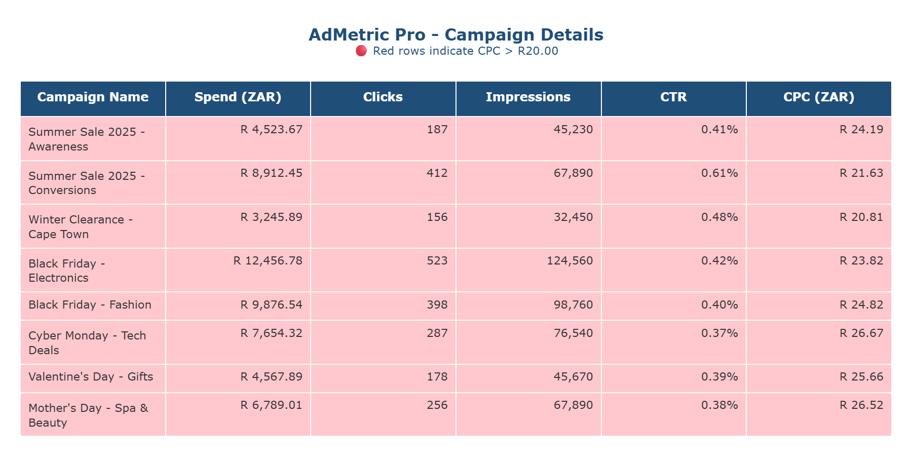
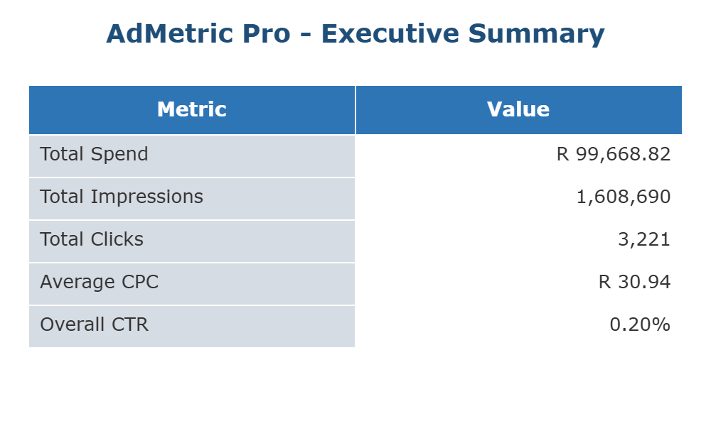

# AdMetric Pro

**Eliminate the Excel Headache. Deliver Client-Ready Reports in Seconds.**

AdMetric Pro is a Python automation tool built for Cape Town digital marketing agencies. It transforms raw Meta (Facebook) Ads CSV exports into professionally formatted Excel reports—complete with ZAR currency formatting, calculated metrics, and executive summaries.

## The Problem We Solve

Every week, your team exports campaign data from Meta Ads Manager. Then comes the tedious part:
- Manually calculating CTR and CPC for each campaign
- Formatting currency columns to ZAR (R)
- Highlighting underperforming campaigns
- Creating summary sheets for clients

**Time wasted**: 2-4 hours per client, per week.

## The AdMetric Pro Solution

One command. Professional reports. Happy clients.

```bash
python -m src.main path/to/meta_export.csv
```

**What you get:**
- Automatic CTR and CPC calculations
- ZAR currency formatting (R1,234.56)
- Red highlighting for campaigns with CPC > R20.00
- Executive Summary sheet with totals and averages
- Timestamped filenames to preserve report history

## See it in Action

### Campaign Details Report
Red highlighting automatically flags campaigns with CPC > R20.00 — no manual formatting required.



### Executive Summary Dashboard
One-glance overview of total spend, clicks, impressions, and key performance metrics.



## Features

| Feature | Benefit |
|---------|---------|
| **ZAR Currency Formatting** | Reports ready for South African clients |
| **Automatic Metrics** | CTR and CPC calculated instantly |
| **Conditional Formatting** | High-cost campaigns highlighted in red |
| **Executive Summary** | One-page overview for busy clients |
| **Timestamped Output** | Never overwrite previous reports |
| **Custom CPC Threshold** | Set your own red flag limit with `--cpc-threshold` |

## Installation

```bash
# Clone the repository
git clone https://github.com/Herman940306/AdMetric-Pro.git
cd AdMetric-Pro

# Install dependencies
pip install -r requirements.txt
```

## Usage

### Basic Usage

```bash
python -m src.main path/to/your/meta_ads_export.csv
```

### With Custom Output Directory

```bash
python -m src.main path/to/meta_ads_export.csv --output reports/
```

### With Custom CPC Threshold

```bash
python -m src.main path/to/meta_ads_export.csv --cpc-threshold 25.00
```

### Expected CSV Columns

Your Meta Ads export must include:
- `Campaign Name`
- `Amount Spent (ZAR)`
- `Link Clicks`
- `Impressions`

## Output

AdMetric Pro generates an Excel file with two sheets:

1. **Campaign Details**: All campaigns with calculated CTR and CPC
2. **Executive Summary**: Total Spend, Impressions, Clicks, Average CPC, Overall CTR

Output filename format: `AdMetric_Pro_Report_2025-12-18_1430.xlsx`

## For Developers

### Running Tests

```bash
pytest tests/ -v
```

### Project Structure

```
AdMetric-Pro/
├── src/
│   ├── main.py           # CLI entry point
│   ├── csv_reader.py     # CSV ingestion and validation
│   ├── metrics.py        # CTR/CPC calculations
│   └── excel_formatter.py # Excel styling and output
├── tests/
├── mock_data/
├── output/
└── requirements.txt
```

## License

MIT License - Built for the Cape Town marketing community.

---

**Questions?** Open an issue or reach out. We're here to help agencies work smarter.
